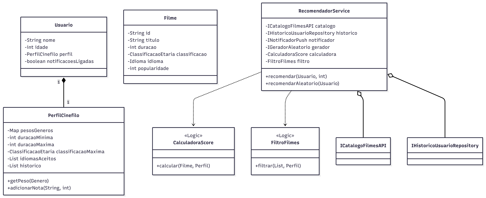
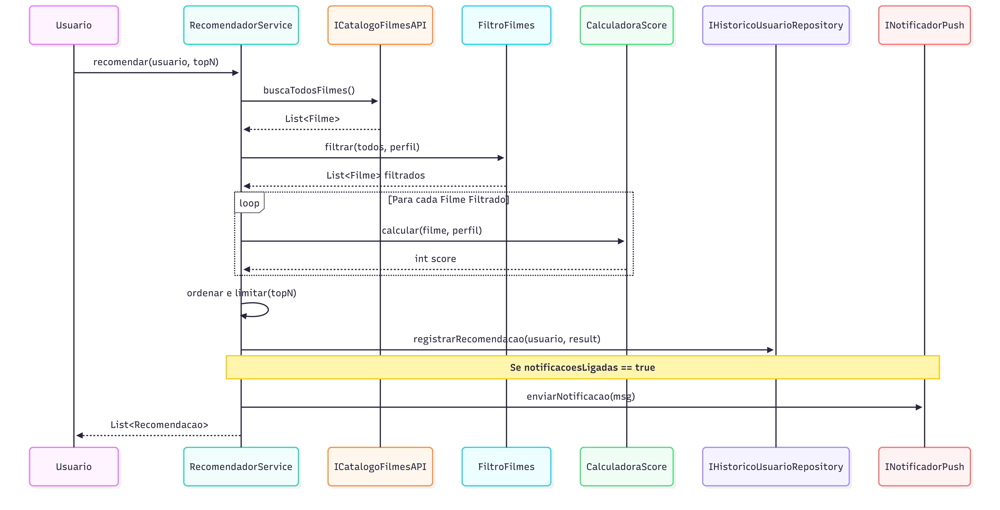
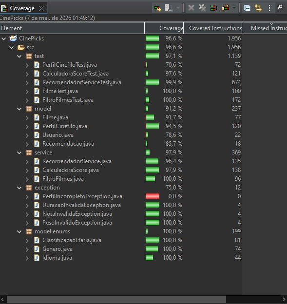

# CinePicks

## Integrantes
- [200038160 - Gabriela do Vale Bomfim de Souza]
- [200033683 - Lucas de Oliveira Ferreira dos Santos]

## Visão Geral
O sistema cruza o perfil de um usuário (gêneros preferidos, duração ideal, classificação etária, etc.) com um catálogo de filmes, devolvendo uma lista ranqueada dos melhores candidatos baseada em um algoritmo de pontuação.

## Como Rodar o Projeto
1. Certifique-se de ter o JDK 17 ou superior (o projeto foi testado no JDK 21/25) configurado no seu ambiente.
2. Importe o projeto na sua IDE (Eclipse, IntelliJ ou VS Code).
3. O sistema é uma API de serviços puros, portanto, a execução principal ocorre através da suíte de testes.

## Como Testar
Foram implementados mais de 20 testes unitários cobrindo as lógicas de negócio, filtros e serviços, atingindo a cobertura mínima exigida.
- As bibliotecas utilizadas foram **JUnit 5** e **Mockito**.
- Para rodar os testes: Execute a pasta `src/test/java` diretamente pela sua IDE (Run as > JUnit Test).

## Arquitetura do Sistema

### Diagrama de Classes

### Diagrama de Sequência

### Cobertura de Testes

